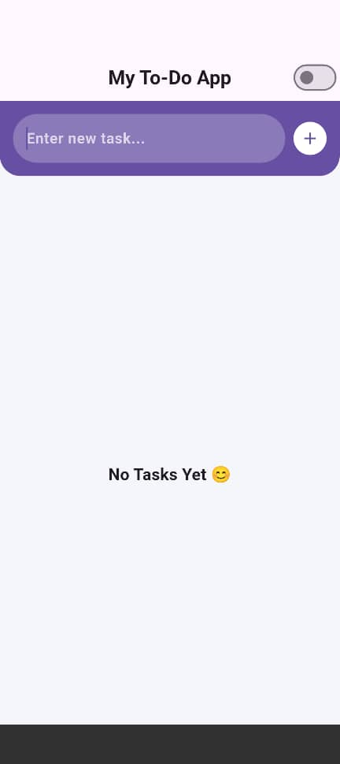
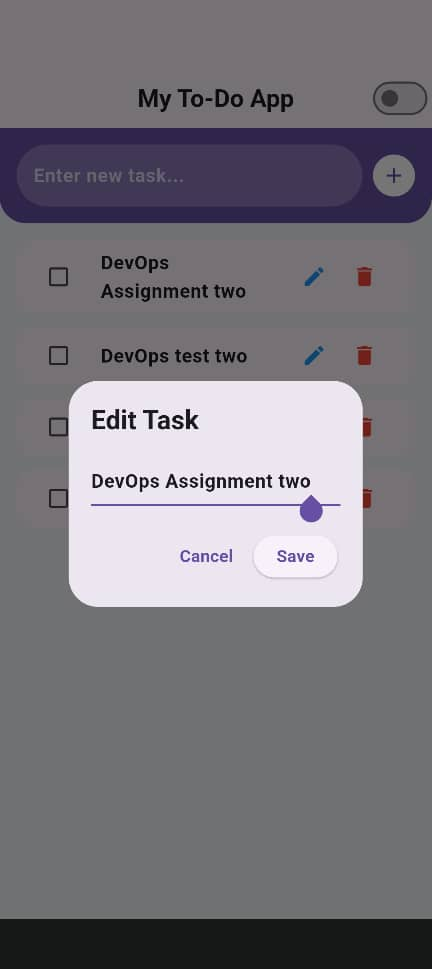

# Flutter To-Do App
**IS 325: Mobile Application Development – Group Assignment**
## Project Description

This project is a simple To-Do List application developed using Flutter.

The application allows users to:

1. Add new tasks with a title.
2. View the list of tasks in a scrollable format.
3. Mark tasks as complete.
4. Delete tasks from the list.
5. Edit task from the list
6. Persist tasks locally so that closing the app does not erase the data.

## Group Members

| Full Name                | Registration No |
| ------------------------ | --------------- |
| GLORIA MICHAEL RYAGUNGA  | 31117/T.2023    |
| ZAKIA NASWABU GEORGE     | 30271/T.2023    |
| SAMIA ADAM HAMAD         | 31263/T.2023    |
| BRAYTON ROGER KIMARO     | 30696/T.2023    |
| MARIA ROBERT MALANGALILA | 31982/T.2023    |
| DAUD FELIX PAULO         | 31722/T.2023    |
| INNOCENT JOHN KIWOLY     | 31019/T.2023    |

## Instructions to Run the App

1. Ensure Flutter SDK is installed on your machine.
2. Ensure you have an Android Emulator or physical device connected.
3. Clone the repository:
git clone https://github.com/Bra-ger12/Flutter-To-Do-App-assignment

4. Navigate into the project folder:
cd Flutter-To-Do-App-assignment

5. Install dependencies:
flutter pub get

6. Run the application:
flutter run

## Screenshots

### 1. Main Screen with no Task

### 1. Main Screen with Task

### 2. Adding a Task

### 3. Edit a Task

### 3. Completing a Task

### 4. Deleting a Task

